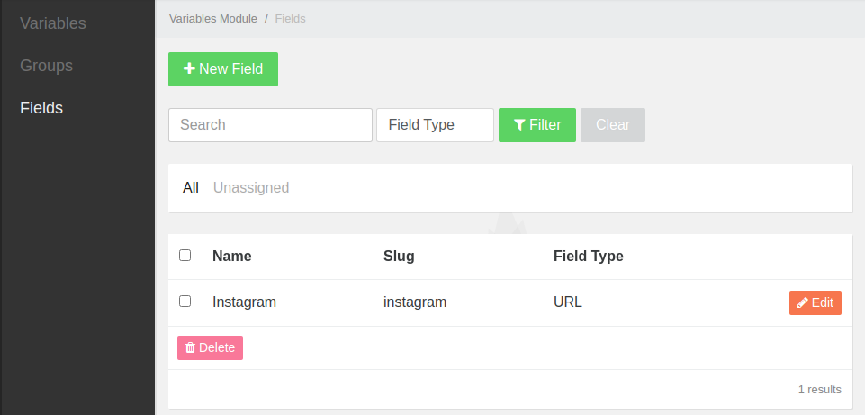
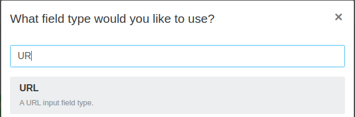
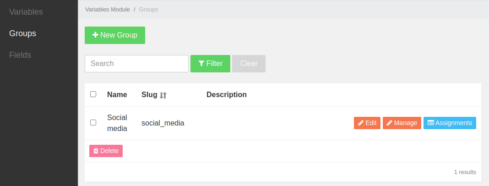
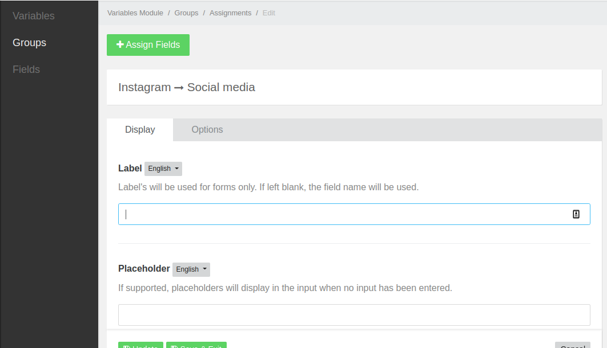
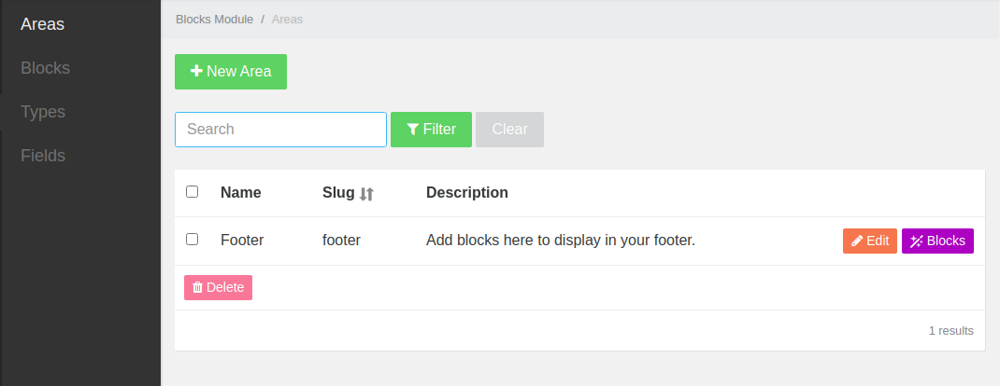
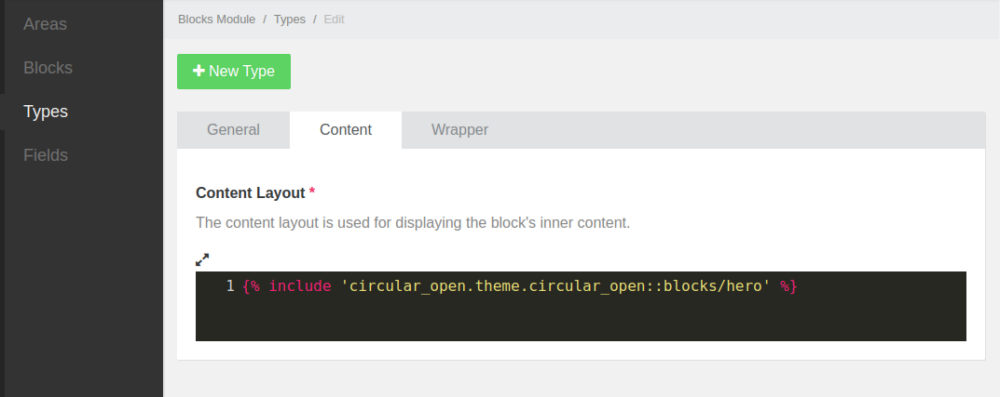
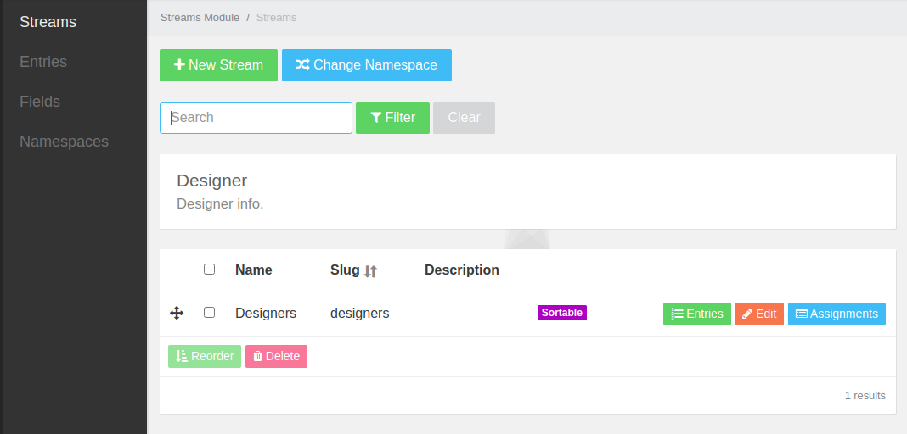
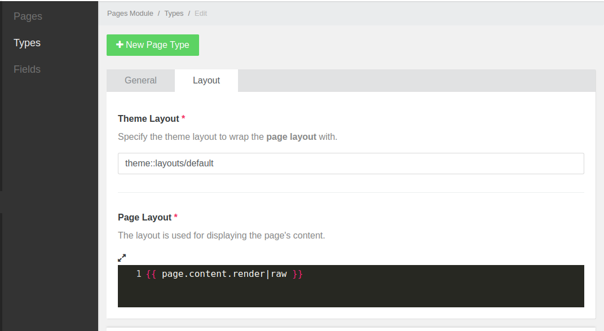
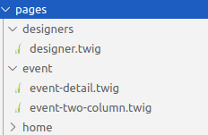
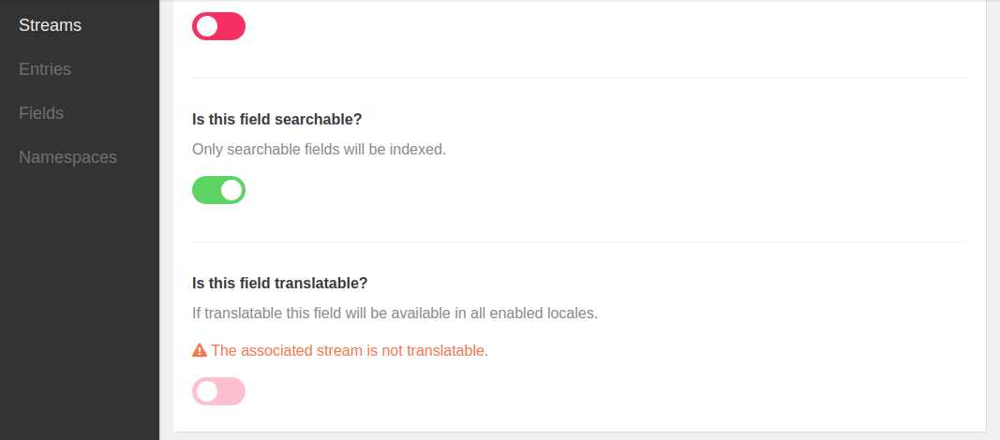

# Overview
Circular open is built using PyroCMS which is an intuitive CMS based off Laravel framework. This documentation is particularly created for developers who sought to make modifications on the site. 

All the fields used across the site are added and managed in CMS. There are no code trails of the models and fields in the codebase so if you are going to update the fields after the site has been deployed, you will need to use the [migration functionality](https://pyrocms.com/documentation/streams-platform/1.4/database/migrations "migration") from Laravel.

#### Global variables / Adding a field
Global variables are useful for links or information are available across the site. This could be social media links, opening hours, or contact details.

To add a new field, head to **Variables** and click **Fields**.



From the prompt click a field you would like to add, for this example, use the URL field.



Once you add the field, fill in the form - mainly the **Field Name**. You are free to add more information as you create more fields.

#### Adding Types / Groups
Once you have created fields, you will need to assign the fields to a **type** or a group. A **Type** or **Group** is a wrapper or holder for the fields that fit a specific purpose. From the example above, we have created a variable, we can create a Group that holds all our social media links.

**Creating a Group**
To create, click create **Groups** and fill in the Name and description. You can choose if you want the group versionable or translatable. 



#### Assigning fields to a group or type
Once you created the group/type and fields, you can now assign the fields into the group. To do that, head to the **Group** or **Types**, and click the Assignments. A prompt with a list of the fields you have created should appear.  Fill in the form mainly the label and hit **Update**.
> Important note: assigning a field is the prominent step to get the group or blocks ready for content.



#### Adding Areas
Areas consist of multiple blocks. This is useful for footer or a larger area with a group of blocks. To add **Area**, it is similar to adding fields and assigning them to a group which is detailed above.



#### Adding repeaters
Repeaters are useful for repeatable components inside a block or larger scale like pages and areas. To add repeaters, it’s a similar process as above; creating fields, create a repeater, assign the fields in the repeater.

### Adding template to a block
There are 2 ways of adding markup into a block.
1. Adding directly to the content tab of the block.
2. Adding the markup in the codebase and include the template in the content tab.



#### Streams
[Streams module](https://pyrocms.com/documentation/streams-module/1.3/usage/namespaces "streams module") is a data management that allows you to manage or update data in the control panel.

- Namespace - namespaces allow you to group related streams into meaningful groups.
- Virtualisation - when enabled namespaces will behave like "virtual" modules:
* The namespace icon and name will appear in the navigation.
   * The namespace slug will be used as the virtual module URI.
   * Streams within the namespace will become module sections.
    * Streams within the namespace will generate separate CRUD permissions.

#### Changing namespace
When you create multiple namespaces, you need to be mindful in which streams you are adding the fields you created. You also need to be mindful of which stream are you creating your field. Make sure that you have switched namespaces to the specific namespace you are managing by clicking the **Change Namespace** and clicking the namespace



#### Adding Page type
A similar process to adding group or types, you can also create a page type that consists of blocks, repeaters, fields, and multiple relationships.

You can also edit the layout of the page by editing the layout in the **Layout tab**.



If you wanted more control over a page, you can create a folder with twigs inside it.



# CLI Commands and configs

[PyroCMS cheatsheet](https://github.com/pixney/pyrocms-cheatsheet "cheatsheet") is a collection of useful information when building a PyroCMS website.

**Restoring database**

```
- Mark remote as INSTALLED=false in .env
- Import DB
- Change DB name in .env
- php artisan streams:compile
- Mark remote as INSTALLED=true again.
```

**Adding a theme**

There are few ways of creating a theme, but the easiest way so through the command line:

```
php artisan make:addon my_client.theme.awesome
```
If you want to find more information, click [Theme creation](https://pyrocms.com/help/addon-development/themes/creating-a-theme "cheatsheet")Theme create.

**Clearing cache and assets**

After you have set up the front-end packages, after compiling your assets, you need to clear the assets in the public folder and clear caches.
```
php artisan assets:clear
php artisan cache:clear
php artisan view:clear
php artisan twig:clear
```

**Overriding Configs**

If you wanted to override a core field or a module, you can easily generate the files using a command that creates the structure of the module configs.  You can find more [here](https://pyrocms.com/help/developer-tools/extending-pyrocms/overriding-configurationw "configs").

```
php artisan addon:publish anomaly.field_type.wysiwyg
```

then  you can edit the files to your liking

```
"example" => [
    "type"   => "anomaly.field_type.wysiwyg",
    "config" => [
        "default_value" => null,
        "configuration" => "default",
        "line_breaks"   => false,
        "sync"          => true,
        "height"        => 500,
        "buttons"       => [],
        "plugins"       => [],
    ]
]
```

**Overriding blocks/view**

When you created a theme through CLI, you should be able to have 2 files in src/ folder.

1. <ThemeName>Theme.php

2. <ThemeName>ServiceProvider.php

Head to the <ThemeName>ServiceProvider.php and look for `$overrides`. Example below.

```
    /**
     * The addon view overrides.
     *
     * @type array|null
     */
    protected $overrides = [
        'anomaly.extension.wysiwyg_block::content' => 'circular_open.theme.circular_open::blocks/wysiwyg/content',
        'anomaly.module.blocks::types.wrapper' => 'circular_open.theme.circular_open::blocks/wysiwyg/wrapper'
    ];
```
On the **left** is the core module views and on the **right** is your override views file.

> Make sure you are overriding the right addon or core module view files. 

#### Searchable streams and fields
You can make any field searchable by toggling the **Searchable** when assigning a field into a group or stream.



We have used the Pyrocms' [search module](https://pyrocms.com/documentation/search-module/3.0/getting-started/installation"cheatsheet") that uses the [Laravel scout](https://laravel.com/docs/5.5/scout"scout") functionality.

Important steps:

- Add the SCOUT_DRIVER=search in the .env upon installation
- All the streams (dataobject) has already set to ‘searchable’ in the CMS 
- Indexing is the last step, pretty much do (as documented [here](https://pyrocms.com/documentation/streams-platform/1.7/reference/cli-commands#streams-index"index"))
```
php artisan streams:index`
php artisan streams:compile
```

#### Mail configs
When setting up smtp, you need to set configuration in `config/mail.php` as well as in `.env`.
> NOTE: Tricky part is, when you set this all config, you have to go in the cms ( /admin/settings#tab-email) and hit update! It doesn’t apply these changes even though you restart the server or clear the cache and config.

Example:
```
# in .env
MAIL_DRIVER=smtp
MAIL_HOST=mailhog
MAIL_PORT=1025
MAIL_USERNAME=null
MAIL_PASSWORD=null
MAIL_ENCRYPTION=null
```

```
// config/mail.php
<?PHP 

return [
    'driver' => env('MAIL_DRIVER', 'smtp'),
    'host' => env('MAIL_HOST', 'mailhog'),
    'port' => env('MAIL_PORT', 1025),
    'from' => [
        'address' => env('FROM_ADDRESS', 'hello@ciruclaropen.com'),
        'name'    => env('FROM_NAME', 'Rachel'),
    ],
    'encryption' => env(''),
    'username' => env('MAIL_USERNAME'),
    'password' => env('MAIL_PASSWORD'),
    'sendmail' => '/usr/sbin/sendmail -bs',
    'pretend' => false
];
```

#### Testing configs: 
To test if the config has been set, copy this code and paste it in config/api.php, then hit `<URL here>/api/test`

```
Route::get('test', function () {
    dd(Config::get('mail'));
});
```
