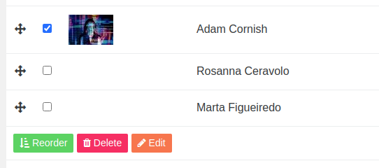

# User documentation
Circular open is built using [PyroCMS](https://pyrocms.com/ "Pyro"), for this documentation, we will be using a specific user that has only access to the content. This user has permission to:

- Add/edit pages
- Add blocks
- Reorder
- Add/edit stream entries
- Upload images/files

  

Most the components for the website can be found in the sidebar:

- Designer - a list of data (stream) is a collection of data points that creates data as a whole. The designer stream is consists of bio, role, content, etc. 
- Event - same with a designer but has different fields mainly for event details.
- Files - a shortcut to uploading, reordering, and deleting images and files that can be reuse across the site.
- Redirects - adding redirects to pages
- Streams - the list of all streams used in the entire site
- Users - lists of users who have access to the site who has various user roles and permissions
- Waste material - category stream which is mainly used for designers stream

# Basic how to's:

#### How to login
To log in, add ‘/admin’ at the end of the url and you should have the form to login to the CMS.

  

> `Important note:` Make sure that your administrator has added you as a content author and activated your account to be able to log in. Once you have received your temporary credentials, you have to reset your password.

#### How to reset password
1. There are 2 ways of resetting the password;
Logged in - when you are logged in, you can head to the **Users** link from the side navigation and search for your name. Click the blue button and hit **Reset password**. A prompt message should appear and hit yes. A password reset link should be sent to your email.

  

2. Logged out - when you are logged out, you may hit the Reset password under the login form. Enter your email address and hit submit. You should get a password link sent to your email.

#### How to add pages
To create a new page, head to the sub-navigation and click **Pages**, click the ‘New Page’ button. A prompt should pop up to choose a page type. At this point, there is only a single page type which is the **Basic** page type. You can change the name of the page, the slug (URL) of the page will be simultaneously created.

  

1. **Publishing** - if you create a page, it publishes the page publicly by default unless you switch the status in the Options tab. You can also set the date when you want to publish the page.

  

2. **Viewing the page** - to view the page, whether it is on the draft mode of public, you can check the page using the View button at the right bottom of the page.

  

3. Versions - you can check the versions of the pages, who updated or deleted the pages using the Version  button at the right bottom of the page. It will display a list of changes. 

> Important note: the system doesn’t allow you to see what changes have made. Please use with caution.

  

#### How to add stream entries

What are streams? Streams are a collection of data points that creates data as a whole. Designer and Event are streams and they are consists of fields and blocks collected in data called **Entry**.

**Adding an entry:**

Head to the side navigation and click **Designer**, click **New** and fill in the fields.

  

#### How to add blocks
Blocks are movable components which are building blocks of a page. There are various types of blocks that are specifically built for certain layout and design.

**Adding a block on a page**

On the middle section of the page, under the **Content** field, click **Add block**. A prompt should display with a list of blocks available to add. The list of blocks is listed below including the example.

  

# Blocks

**Banner**

To switch the background colour,  just simply toggle the **Switch** background and hit **update**.

  

**Carousel**

There are 2 types of carousel we can add on pages. These carousels have only one source of data which is in the **Slides** streams.

  

1. Default carousel - The main layout is an image on the left and text on the side.

  

2. Feature carousel - The block has 2 fields, one is the **label** which shows in the left on a stack and the **Slide** dropdown where you can choose which slide to display. The label also controls a slide meaning if you click the label it will transition to that label’s slide.

  

**Cards (4 columns)**

Tip: You can rearrange the cards using the move cursor.

  
  

**Contact details**

Mainly displays the designer contact details. Note that you cannot reorder the details.

    
    

**Designers (4 column photo)**

Four grid column of all designers in the entries added in the designer stream. Reordering is available and is documented below.

**Designers (3 columns)**

In contrast to the 4 columns, this block allows you to choose designers to display on the front-end.

    
    

**Event list (2 columns)**

Same with the 3 columns, you can also choose the events to display. It will display as 2 grid column.

    
    

**Full-width image**

Serves one image field and a title.

**Hero**

Title, subtitle, and content.

  

**Side by side (image and text)**

Tip: to switch the position of the image, just simply toggle the Switch position and hit update.

  

**Videos 2 (column)**

Tip: You can copy and paster the youtube URL and it will automatically embed it. 

  

**Visit map**

The map is using [SnazzyMaps](https://snazzymaps.com/ "Named link title"). This map is combination of configs to make the look and feel and API key.

  

# How to reorder things
If you find yourself wanting to reorder blocks or streams, it’s actually easy to do. 

**Blocks**

If you wanted to rearrange the blocks, for this example, on the homepage, you can do so by moving the move cursor and using the drag-and-drop motion. To make reordering easier, you can **Double click** on the **black** bar to minimise the block. Once you have done your reordering, just simply hit update.

  

**Streams**

Same as the other reordering, you can move the move cursor and drag-and-drop the data you want to reorder and hit **Reorder**, that will update the reordering mainly in the 4 column designer.

  

